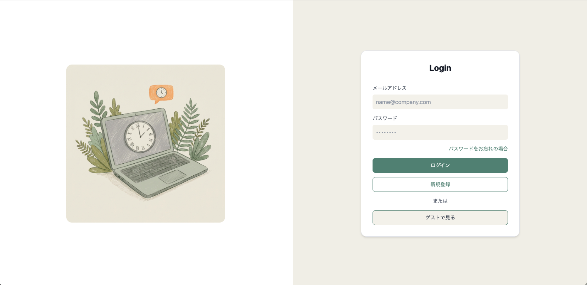
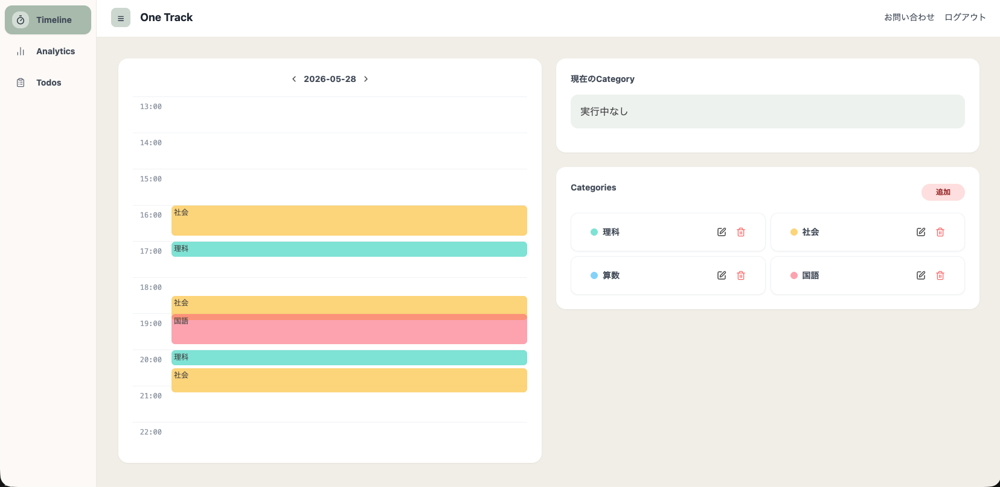
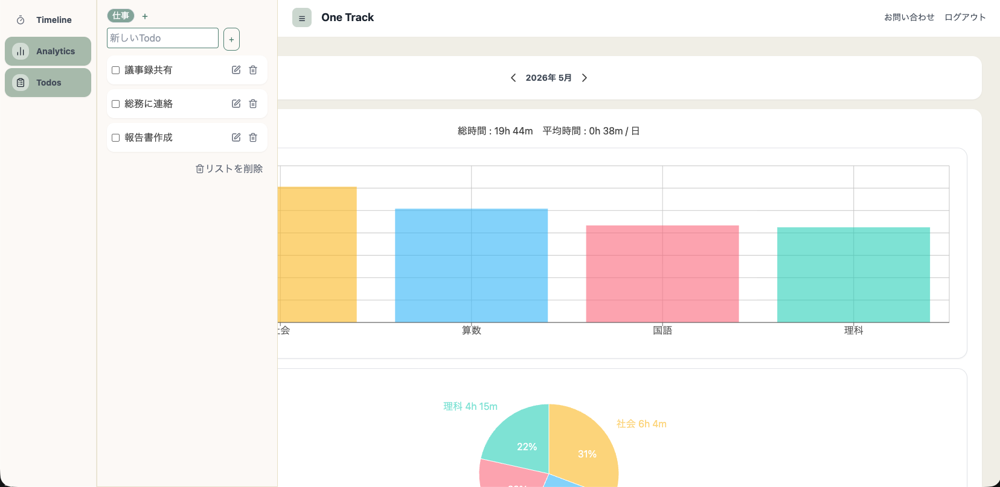
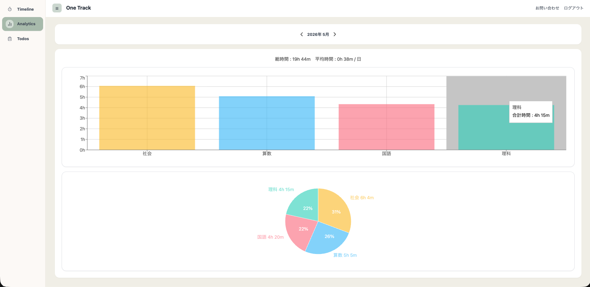

# Time Track Log 🕰️

資格勉強中に愛用していたタイムログアプリをヒントに、**PCブラウザで使えるシンプルなタイムトラッキングツール**を自作しました。作業時間の記録・可視化・Todoリスト管理を1画面で完結できます。

## 機能・特徴

- ⏱️ **タイムライン** — カテゴリを作成してタイマーで作業時間を記録
- 📝 **Todoリスト** — カテゴリ別にタスクをサイドバーで管理
- 📊 **月次アナリティクス** — カテゴリ別・日別の合計時間をグラフで可視化
- 🔐 **認証** — メール/パスワード認証、ゲストログイン、パスワードリセット（メール送信）

## 技術スタック

| カテゴリ | 技術 |
|---|---|
| フレームワーク | Next.js 14 (App Router) |
| 言語 | TypeScript 5 |
| UI | React 18 |
| UIコンポーネント | shadcn/ui + Radix UI |
| スタイリング | Tailwind CSS 3 |
| アイコン | Lucide React |
| 状態管理 | Zustand |
| 認証 | 自前実装（jose JWT + bcryptjs） |
| ORM | Prisma 6 |
| DB | MySQL |
| バリデーション | Zod |
| フォーム | React Hook Form + @hookform/resolvers |
| データフェッチ | SWR |
| グラフ | Recharts |
| メール送信 | Resend |
| デプロイ | AWS EC2（予定） |

## アーキテクチャ

API Routes をレイヤードアーキテクチャで構成しています。

```
src/
├── app/
│   ├── api/              # Route Handlers（エントリポイント）
│   ├── user/             # 認証済みページ（timeline / analytics / settings）
│   ├── contact/          # コンタクトフォーム
│   ├── signin/           # サインイン
│   ├── signup/           # サインアップ
│   ├── reset-password/   # パスワードリセット
│   └── update-password/  # パスワード更新
├── services/             # ビジネスロジック層
├── repositories/         # DB アクセス層（Prisma）
├── schemas/              # Zod バリデーションスキーマ
├── store/                # Zustand グローバルストア
├── components/ui/        # shadcn/ui コンポーネント
└── types/                # 共通型定義
```


リクエストの流れ：`Route Handler → Service → Repository → DB`

## 設計資料

- [画面遷移図（Figma）](https://www.figma.com/design/YJQt8LYCqSwFhkYdEs2MHG/%E3%82%AA%E3%83%AA%E3%82%B8%E3%83%8A%E3%83%AB%E3%82%A2%E3%83%97%E3%83%AA?node-id=0-1&t=l5ccdrvYg4QZij3C-1)
- [ER図（Miro）](https://miro.com/app/live-embed/uXjVHNQ2Yso=/?embedMode=view_only_without_ui&moveToViewport=-854%2C-893%2C1548%2C1388&embedId=575390242521)

## デモ・スクリーンショット

> ※ デモは [Supabase でデプロイされた旧 Version](https://github.com/mizunatoma/my-original-app) です。本リポジトリは AWS EC2 へのデプロイを予定しています。

[➡️ デプロイリンク](https://my-original-946wi5kzv-tomiiii-coders-projects.vercel.app/)　ゲストログインで試せます！

---

### ログイン画面


### タイムログ画面


認証・記録デモ：https://www.loom.com/share/503c9dd329774a62add25db48cf0e61e

### Todoメモ（サイドバー）


操作デモ：https://www.loom.com/share/d71667f6e03240459a9c1ab7fa6e0306

### アナリティクス画面


操作デモ：https://www.loom.com/share/b180f90524f74925a680b1db5c0332af
