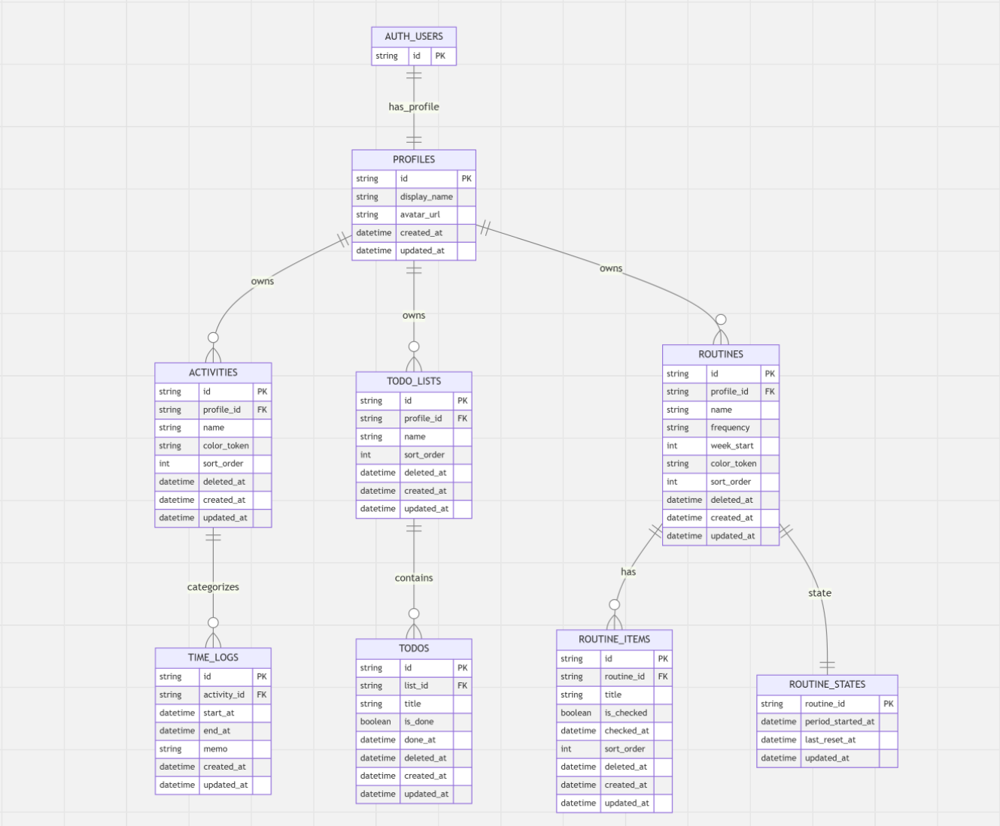

# Time Track Log 🕰️

**タイマー記録とTodo管理を同一画面にまとめ、学習時間の記録から月次の振り返りまで行えるWebアプリ**

[🚀 アプリを試す](https://learning-track.com) ｜ [🎥 操作デモを見る（Loom）](https://www.loom.com/share/503c9dd329774a62add25db48cf0e61e)

> 登録不要のゲストログインで、デモデータをすぐに操作できます。

「勉強に集中したいのにスマホが手放せない・記録しても振り返りづらい」——資格勉強で使っていた記録アプリへの不満を、自分で解決するために開発しました。

- ワンクリックでタイマーを開始・終了
- 学習時間をカテゴリ別・日別に可視化
- 毎日21時に、その日の学習実績をLINEへ通知

`Next.js 14` `TypeScript` `Prisma` `MySQL`

設計・運用：Route Handler / Service / Repositoryの層分離、JWT認証、GitHub Actions、AWS EC2

## 📸 スクリーンショット

| ログイン                                              | タイムログ                                                |
| ----------------------------------------------------- | --------------------------------------------------------- |
|  |  |

| アナリティクス                                                 | Todoリスト（サイドパネル）                                             |
| -------------------------------------------------------------- | ---------------------------------------------------------------------- |
|  |  |

**操作デモ（Loom）**: [Todo操作](https://www.loom.com/share/d71667f6e03240459a9c1ab7fa6e0306) / [アナリティクス](https://www.loom.com/share/b180f90524f74925a680b1db5c0332af)

## ✨ 主な機能

| 機能                  | 内容                                                                       |
| --------------------- | -------------------------------------------------------------------------- |
| ⏱️ タイムライン       | カテゴリ別タイマー記録・実行中タイマーの復元・メモ・履歴のページネーション |
| 📊 月次アナリティクス | カテゴリ別・日別の合計時間をグラフ化                                       |
| 📝 Todoリスト         | 複数リストの作成・並び替え・完了/削除管理（サイドパネル統合）              |
| 🔔 LINE通知           | アカウント連携＋毎日21時に学習記録・Todo完了サマリーを自動配信             |
| 🔐 認証               | メール/パスワード・ゲストログイン・パスワードリセット（メール送信）        |

## 🛠 技術スタック

| カテゴリ       | 技術                                                      |
| -------------- | --------------------------------------------------------- |
| フレームワーク | Next.js 14 (App Router)                                   |
| 言語           | TypeScript 5                                              |
| ORM / DB       | Prisma 6 / MySQL                                          |
| バリデーション | Zod 4                                                     |
| データフェッチ | SWR                                                       |
| 状態管理       | Zustand                                                   |
| UI             | shadcn/ui + Radix UI + Tailwind CSS 3                     |
| 認証           | joseを用いたJWT認証フロー + bcryptjs                      |
| その他         | Recharts / React Hook Form / Resend / node-cron / winston |

**テスト・インフラ**: Vitest / Playwright / GitHub Actions（CI・CD）/ AWS EC2

> 認証フローを自分の手で理解するため、Supabase Authから**joseを用いたJWT認証の自前実装**へ置き換えました。

---

## 📌 開発の背景

資格試験の勉強時間をモバイルアプリで記録していた経験が原点です。使ううちに感じた不満を、ひとつずつ自分の手で解決しました。

- スマホを手放したい → **PCブラウザで完結するWebアプリ**（スマホと併用可）
- アナリティクスが見づらい → **自分がほしい切り口の月次グラフ**
- 今日の予定を紙に書いていた → **Todoを同一画面のサイドパネルに統合**
- 毎日の進捗が見えることがモチベーションだった → 予定のリマインドではなく、**「今日できたこと」を毎晩LINEに通知**

最初はUIモックから始めましたが、データを永続化し、自分がほしい切り口で集計するためにバックエンドとDBを学びました。この開発が、本格的にWeb開発を学ぶきっかけになっています。

## 🏗 アーキテクチャ

Next.js App RouterのRoute Handlersを、**Route Handler・Service・Repositoryの3層**に分けています。

```
Route Handler   … Zodによる入力検証・HTTPステータスの決定
      ↓
Service         … ビジネスロジック
      ↓
Repository      … Prismaによる DB アクセス
      ↓
MySQL
```

**なぜ分けたか**

- 当初はRoute Handlerにすべてをフラットに書いていましたが、同じ処理の重複が増え「一箇所直すと全部直す」手間が発生。責務ごとに分離して解消しました。
- 分離によって各層の入出力が明確になり、主要なビジネスロジックが**Vitestで単体テストしやすくなった**のも実感した利点です。
- 認証Serviceには現在Next.jsのCookie APIへの依存が残っており、Cookie操作をRoute Handler側へ寄せるのが今後の改善テーマです。

## 💡 工夫したポイント

### 型安全・バリデーション

- Zodスキーマを**API入力検証とReact Hook Formのresolverで共用**し、検証ルールの二重管理を排除
- APIレスポンスのDTO型を `src/types/api.ts` に集約し、フロント/バックで同じ型を参照

### セキュリティ

- JWTを **HttpOnly / Secure（本番環境） / SameSite=Strict** のCookieで管理。middlewareに認証不要パスを列挙し、**それ以外のページ・APIをJWT検証の対象**に設定
- ログイン失敗時はメール不存在・パスワード不一致とも**同一の401**を返却（アカウント列挙対策）

### パフォーマンス

- Rechartsを**dynamic import**し、アナリティクス画面の初期JSを**220kB→104kB**に削減（`next build` 出力のFirst Load JSで前後比較）
- LINE通知処理の**N+1を解消**：ユーザーごとに通知対象データを取得していた処理を `IN` 句による一括取得へ変更し、1回の通知処理あたり**1+N回→2回に固定**
- 履歴APIに**limit/offsetページネーション**を実装

### 保守性・運用

- **CI**: `main` 向けPRでlint / 単体テスト / build / E2Eを自動実行
- **CD**: `release` ブランチへのpushを契機にEC2へ自動デプロイ
- seedでゲストユーザー・デモデータを投入し、レビュアーがすぐ試せる状態を担保

### テスト

- **Vitest**（Zodスキーマ・Service層・カスタムフックの単体テスト）＋ **Playwright**（認証フローのE2E）

## 🗄 データベース設計



- `Activity`・`TodoList`・`Todo` に `deletedAt` を持たせ、ユーザー操作による削除を**論理削除**として実装
- 頻出クエリを **`EXPLAIN` で確認して複合インデックスを設計**
  - `TimeLog @@index([activityId, endAt])`：カテゴリ単位の期間検索・実行中タイマー検索用
  - `TodoList @@index([profileId, deletedAt, sortOrder])`：一覧取得時のfilesort解消を確認
- 文字列カラムは用途に応じた `VARCHAR` 長を明示

**設計資料**: [ER図（Miro）](https://miro.com/app/live-embed/uXjVHNQ2Yso=/?embedMode=view_only_without_ui&moveToViewport=-854%2C-893%2C1548%2C1388&embedId=575390242521) / [画面遷移図（Figma）](https://www.figma.com/design/YJQt8LYCqSwFhkYdEs2MHG/%E3%82%AA%E3%83%AA%E3%82%B8%E3%83%8A%E3%83%AB%E3%82%A2%E3%83%97%E3%83%AA?node-id=0-1&t=l5ccdrvYg4QZij3C-1)

## 🚀 デプロイ

**AWS EC2**（PM2 + Nginx + SSL）で運用。GitHub Actionsにより `release` ブランチへのpushを契機に自動デプロイされます。

## 📂 ディレクトリ構成

<details>
<summary>クリックで展開</summary>

```
src/
├── app/
│   ├── api/               # Route Handlers（auth / timeline / todo-lists / todos /
│   │                      #   analytics / profile / line / contacts）
│   ├── user/              # 認証済みページ（timeline / analytics / settings）
│   ├── signin/ signup/    # 認証ページ
│   ├── reset-password/ update-password/  # パスワードリセットフロー
│   ├── contact/           # コンタクトフォーム
│   ├── _lib/              # JWT発行・検証（jose）
│   └── _utils/            # Prismaクライアント / 認証ユーザー取得 / フォーマッタ
├── services/              # ビジネスロジック層
├── repositories/          # DBアクセス層（Prisma）
├── schemas/               # Zodスキーマ（API・フォーム共用）
├── types/                 # APIレスポンスのDTO型定義
├── store/                 # Zustand（ログインユーザー情報）
├── hooks/                 # 汎用フック（useDebounce / useLocalStorage、テスト付き）
├── components/            # shadcn/ui・フォーム共通コンポーネント
├── lib/                   # LINE Messaging API / winston logger / utils
├── middleware.ts          # JWT検証によるルート保護（ホワイトリスト方式）
└── instrumentation.ts     # node-cronの登録（サーバ起動時）
prisma/                    # schema / migrations / seed（ゲスト・デモデータ投入）
e2e/                       # Playwright E2E（認証フロー）
.github/workflows/         # CI（lint / test / build / E2E）・CD（EC2自動デプロイ）
```

</details>

## 🔧 今後の改善

- **Googleログイン（OAuth）**: 外部認証の導入でログインの手間を減らす
- **レスポンシブ対応・PWA通知**: スマホでの利用体験の底上げ
- **ルーティン機能**: Prismaスキーマに `Routine` 系モデルは定義済みだが、API・画面は未実装
